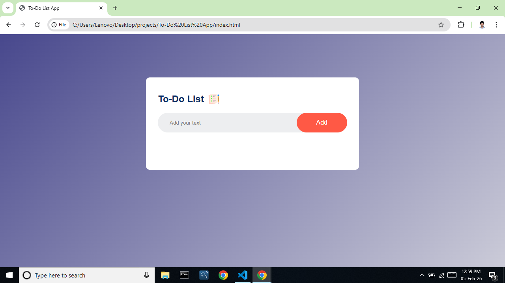
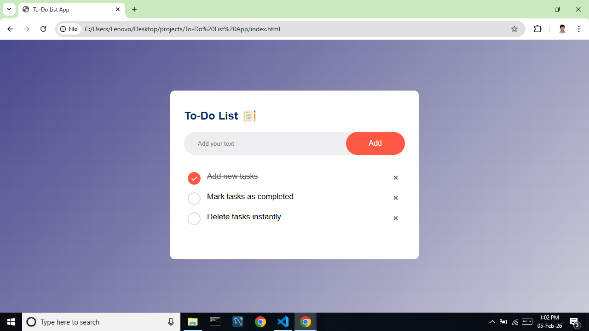

# ✅ To-Do List App

<div align="center">


</div>

<br/>

> A clean, responsive **To-Do List Application** built with **HTML, CSS, and JavaScript**.
> Demonstrates task management with persistent storage using browser localStorage — no backend required.

---

## 🚀 Key Features

| Feature | Description |
|---|---|
| ➕ **Add Tasks** | Create new tasks instantly |
| ✅ **Complete Tasks** | Toggle task completion with a single click |
| 🗑️ **Delete Tasks** | Remove tasks instantly with the × icon |
| 💾 **localStorage** | Tasks persist across page reloads and browser restarts |
| 🔄 **Auto Sync** | Storage updates automatically on every action |
| 📱 **Responsive UI** | Clean card-based layout across all screen sizes |
| ⚡ **No Dependencies** | Pure HTML, CSS & JS — no frameworks or build tools |

---

## 📸 Screenshots

<details>
<summary>Click to view screenshots</summary>

### 🏠 Home Screen


### ✅ Completed Task


</details>

---

## 🛠 Tech Stack

| Layer | Technology |
|---|---|
| **Structure** | HTML5 |
| **Styling** | CSS3 — Gradients, Responsive Layout |
| **Logic** | JavaScript ES6+ — DOM Manipulation, localStorage |
| **Version Control** | Git & GitHub |

---

## 📂 Project Structure
```
To-Do-List-App/
├── index.html      # Main HTML structure
├── style.css       # Styles and layout
├── script.js       # App logic and localStorage
├── images/         # Icons for task states
└── screenshots/    # Project screenshots
```

---

## ▶️ Run Locally

> **No dependencies or build tools required**

### 1️⃣ Clone Repository
```bash
git clone https://github.com/royhamlinjr/To-Do-List-App.git
cd To-Do-List-App
```

### 2️⃣ Open in Browser
Simply open `index.html` in any modern web browser.

---

## 🧠 Concepts Demonstrated

**JavaScript & Storage**
- DOM Manipulation — dynamically add, update, and remove elements
- localStorage API for client-side data persistence
- Event listeners for click and input interactions
- JSON serialization for storing task arrays

**CSS & Layout**
- Responsive card-based layout
- Custom checkbox icons for task states
- Smooth gradients and clean typography

---

## 🔮 Future Enhancements

- [ ] 🗂️ **Task Categories** — Organize tasks by category or priority
- [ ] 📅 **Due Dates** — Assign deadlines to tasks
- [ ] 🔍 **Search & Filter** — Filter by completed or pending tasks
- [ ] 🔐 **Backend Integration** — Sync tasks with a Django or Node.js backend
- [ ] 🚀 **Deployment** — Host on GitHub Pages or Netlify
- [ ] 🌙 **Dark / Light Mode** — Theme toggle switch

---

## 🤝 Contributing

Contributions, issues, and feature requests are welcome!

1. Fork the repository
2. Create your feature branch — `git checkout -b feature/YourFeature`
3. Commit your changes — `git commit -m "Add YourFeature"`
4. Push to the branch — `git push origin feature/YourFeature`
5. Open a Pull Request

---

## 📄 License

This project is licensed under the **MIT License** — feel free to use and modify it.

---

## 👤 Author

<div align="center">

**Roy Hamlin**

[](mailto:royhamlinjr7@gmail.com)
[](https://linkedin.com/in/royhamlin)

</div>

---

<div align="center">

⭐ **If you found this project helpful, please consider giving it a star!** ⭐

*Made with ❤️ by Roy Hamlin*

</div>
